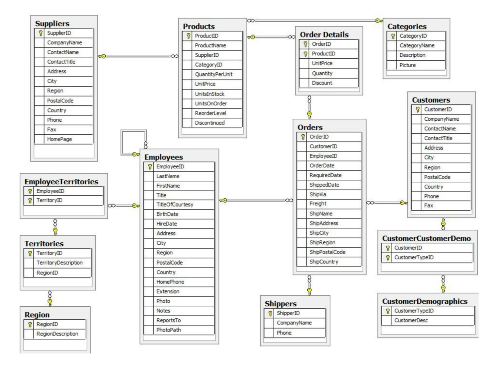

# Learning SQL

Topics to be covered:

- [Basics of Sql](https://github.com/b-45/learning-sql/blob/master/Basics-of-Sql.ipynb)
- String Operations
- Grouping & Computing Aggregates
- Subqueries
- Case Clause
- Set Operations
- Joining Tables
- Analytics: Window Functions

---

Northwind sample dataset will be used for all operation in this tutorial. Northwind is a fictitious company that imports and exports food globally. Here is the schema:

